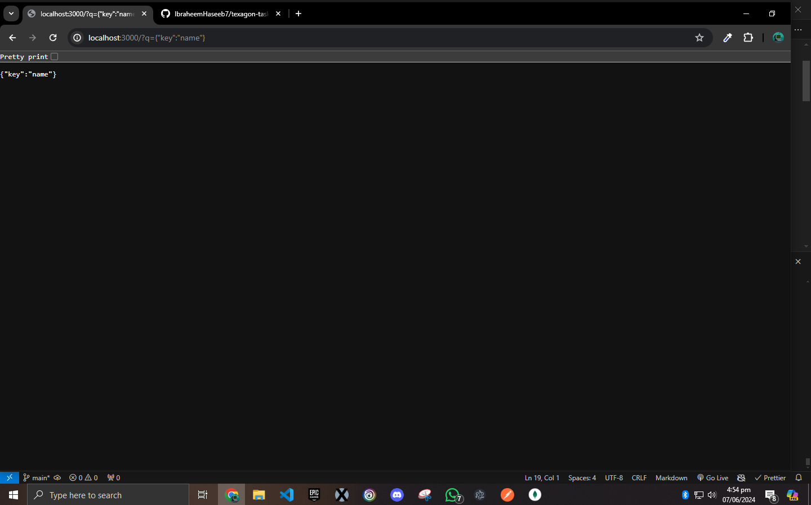
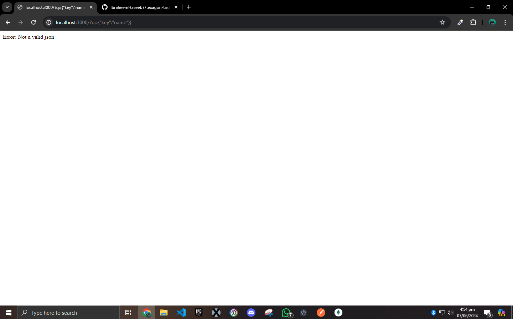
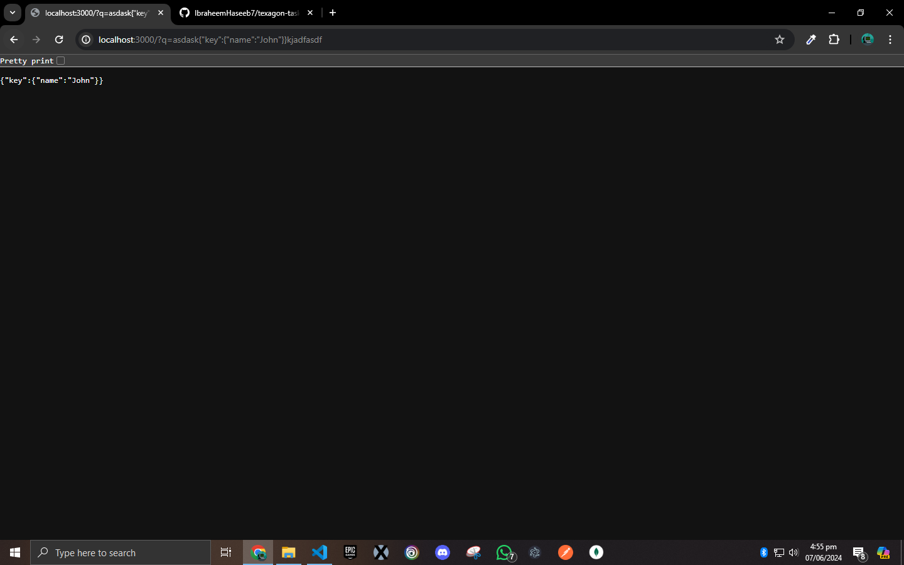

## Valid JSON Task

### Edge cases and their output result is given below in screenshots

#### Test Case: `asdfasdf{"key":"name"}jasdfhsfa`

#### Test Case: `asdfasdf{"key":"name"}`

#### Test Case: `{"key":"name"}ajdflajdf`

#### Test Case: `{"key":"name"}`

#### Test Case: `{"key":"name"}}`

#### Test Case: `asdask{"key":{"name":"John"}}kjadfasdf`

